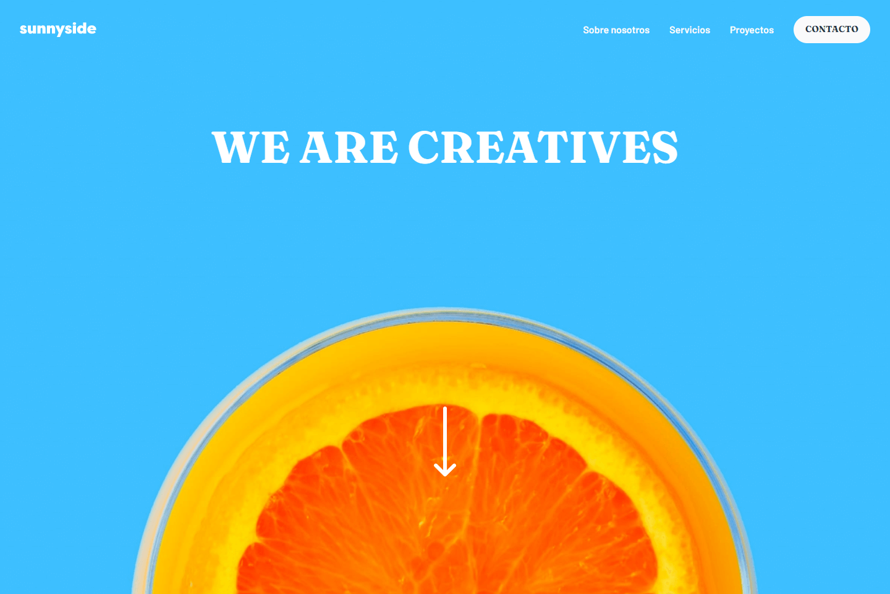

# Frontend Mentor - Sunnyside agency landing page solution

Esta es la solución de [Sunnyside agency landing page challenge on Frontend Mentor](https://www.frontendmentor.io/challenges/sunnyside-agency-landing-page-7yVs3B6ef). 
Frontend Mentor ayuda a mejorar tus habilidades mediante la realización de proyectos realistas.

## Tabla de contenidos

- [Resumen](#resumen)
  - [El desafio](#el-desafio)
  - [Screenshot](#screenshot)
  - [Link](#link)
- [Proceso](#Proceso)
  - [Construido con:](#Construido-con)
  - [Que aprendi con este proyecto](#Que-aprendi-con-este-proyecto)
  - [Recurtsos útiles](#recursos-útiles)
- [Comunicate conmigo](#Comunicate-conmigo)

## Resumen

### El desafio

Los usuarios deben ser capaces de:

- Ver el diseño óptimo del sitio web en función del tamaño de la pantalla de su dispositivo 
- Ver los estados de todos los elementos interactivos de la página

### Screenshot

### Link

- [Github Pages](https://nicolasrodriguez3.github.io/Sunnyside-LandingPage-FrontendMentor/)

## Proceso

### Construido con:

- Etiquetas semanticas de HTML5 
- Css
- Flexbox
- CSS Grid
- Mobile-first
- Animaciones
- Y un poquito de JS para el menu mobile

### Que aprendi con este proyecto

Realizar esta landing page me sirvio para reforzar contenidos sobre diseño, mobile-first y medias queries.
Pude poner en practica Grid CSS en conjunto con Flexbox reordenando el layout en funcion del ancho del dispositivo.

### Recursos útiles

- [CSS Grid Garden](https://cssgridgarden.com/) - Me ayudo a practicar con CSS Grid de forma visual y divertida.
- Comunidad Frontend Master en Slack - Me brindaron unos tips muy utiles cuando no podia cambiar el color de los iconos .svg

## Comunicate conmigo

- Linkedin [Connect with me](https://www.linkedin.com/in/nirodriguez/)
- Frontend Mentor - [@nicolasrodriguez3](https://www.frontendmentor.io/profile/nicolasrodriguez3)
